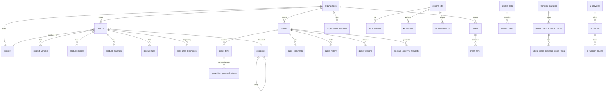

# Auditoria Exaustiva: Banco de Dados ↔ Front-end — Promo Gifts v4

**Projeto Supabase (oficial):** `doufsxqlfjyuvxuezpln` · **Data:** 2026-05-31
**Método:** consultas SQL diretas ao banco _live_ via MCP Supabase + varredura estática de `src/`,
`supabase/functions/` e `supabase/migrations/`.

> Esta auditoria responde à pergunta: **“todas as tabelas estão interligadas no front-end?”**
> A resposta curta: **sim, com 4 exceções de bug e ~9 tabelas órfãs reais** — detalhado abaixo.
> A missão foi dividida em **30 tarefas** (ver `§7`).

---

## 0. ⚠️ Achado crítico de ambiente (ler primeiro)

O ambiente tem **múltiplos servidores MCP Supabase** conectados. Um servidor SQL genérico
(`7dee30df-…`, host `10.0.1.149`) aponta para um **banco COMPLETAMENTE DIFERENTE** — uma plataforma
de WhatsApp/CRM/automação (tabelas `evolution_*`, `bpm_*`, `gmail_*`, `whatsapp_*`; 511 tabelas).
**Esse não é o banco do Promo Gifts.** Auditorias futuras devem usar **apenas** o projeto
`doufsxqlfjyuvxuezpln` (confirmado em `supabase/config.toml:1` e
`src/integrations/supabase/client.ts`), servido pelo MCP cujo `get_project_url` retorna
`https://doufsxqlfjyuvxuezpln.supabase.co`.

---

## 1. Panorama do banco oficial (schema `public`)

| Métrica | Valor |
|---|---:|
| Tabelas | **299** |
| Views | **119** (sendo 59 com prefixo `v_`) |
| Materialized views | 0 |
| Foreign keys | **295** |
| RLS policies | **767** |
| Tabelas **sem** RLS | **0** ✅ |
| Funções (`public`) | **800** |

**Arquitetura multi-banco (ADR 0001).** O sistema usa 3 ambientes Supabase:
1. **Interno** (`doufsxqlfjyuvxuezpln`) — auth, orçamentos, kits, favoritos, segurança, IA, e
   **espelho/SSOT de catálogo** (produtos, categorias, materiais, fornecedores, gravação).
2. **Catálogo externo (SSOT)** e 3. **CRM (Bitrix mirror)** — acessados **somente** via edge
   functions `external-db-bridge` / `crm-db-bridge`, nunca por `supabase.from()` no browser.

Implicação: muitas tabelas “sem `.from()`” **não são mortas** — são lidas via bridge ou escritas
por edge functions/cron/triggers. A classificação em `§4` trata isso.

---

## 2. Acoplamento do front-end com o banco

| Sinal | Valor |
|---|---:|
| Chamadas `supabase.from('…')` (call-sites) | **644** |
| Tabelas/views distintas em `.from()` | **125** |
| Chamadas `supabase.rpc('…')` distintas | **34** (todas existem no banco ✅) |
| Buckets de Storage usados | **7** (`art-files`, `avatars`, `mockup-art-files`, `mockup-assets`, `personalization-images`, `product-videos`, `supplier-logos`) |
| Chaves de tabela em `src/integrations/supabase/types.ts` | **214** |
| Edge functions | **88** (`supabase/functions/`) |

As **34 funções RPC** chamadas pelo front existem todas no banco (verificado 1-a-1 via
`pg_proc`). Nenhum RPC fantasma. ✅

---

## 3. Validação de relacionamentos (FKs)

As **295 FKs** formam um grafo coeso ancorado em:
- **`organizations`** (multi-tenancy): referenciada por `products`, `categories`, `quotes`,
  `orders`, `suppliers`, `material_*`, `tags`, etc.
- **`products`** (hub de catálogo): ~40 tabelas filhas (`product_images`, `product_variants`,
  `product_materials`, `product_tags`, `quote_items`, `order_items`, `favorite_items`,
  `print_area_techniques`, `mockup_generation_jobs`, …).
- **`quotes`** → `quote_items`, `quote_comments`, `quote_history`, `quote_versions`,
  `discount_approval_requests`, `quote_item_personalizations`.
- **`custom_kits`** → `kit_collaborators`, `kit_comments`, `kit_variants`, `kit_share_tokens`.
- **Gravação:** `tecnicas_gravacao` (codigo) ← `tabela_preco_gravacao_oficial` ←
  `tabela_preco_gravacao_oficial_faixa` / `print_area_techniques` / `kit_component_print_areas`.

Não foram encontradas FKs apontando para tabelas inexistentes. Diagrama ER resumido em `§6`.

---

## 4. Cobertura tabela ↔ front (as 299 tabelas, classificadas)

**174 tabelas** são referenciadas direta ou indiretamente; **~9** são órfãs reais. Detalhe das
**179 tabelas sem `.from()` direto**, classificadas por motivo legítimo:

| Classe | Qtd | O que é | Interligado? |
|---|---:|---|---|
| **Catálogo/SSOT via bridge** | ~103 | `products`, `product_*`, `categor*`, `material_*`, `supplier_*`, `color_*`, `variant*`, `tags`, `tecnicas_gravacao`, `tabela_preco_*`, `print_area_*`, `ramo_atividade*`, `b2b_*`, `seo_*` | ✅ via `external-db-bridge` |
| **Staging/Import (pipeline n8n)** | 11 | `*_staging`, `import_*`, `scraper_*`, `sm_*`, `xbz_*`, `_asia_*`, `_unif_*`, `color_analysis_staging` | ✅ por workers/cron |
| **Filas/Workers** | 4 | `ai_description_queue`, `media_sync_queue`, `optimization_queue_runs`, `video_import_queue` | ✅ por edge/cron |
| **Logs/Auditoria/Telemetria** | 25 | `*_log(s)`, `*_audit*`, `*_metrics`, `app_vitals`, `*_snapshots`, `schema_drift_*`, `*_reactions` | ✅ escrita server-side |
| **Sistema/Infra/Segurança/Org** | 18 | `organizations`, `organization_members`, `notification_*`, `edge_*`, `rate_limit*`, `webhook_*`, `step_up_*`, `geo_*`, `kill_switch*`, `secret_rotation_log` | ✅ infra/edge |
| **Server-side (edge/RPC/trigger)** | ~9 | `mockup_*` (via `generate-mockup`), `quote_approval_tokens`/`quote_versions`/`quote_drafts`, `analytics_events`, `search_queries`, `user_favorites`, `user_filter_presets`, `collection_products`, `follow_up_reminders` | ✅ escrita por edge/RPC |
| **🟠 ÓRFÃS REAIS (rever)** | ~9 | ver tabela abaixo | ⚠️ sem referência alguma |

### 4.1 Tabelas órfãs reais (zero referência em `src/` **e** `supabase/functions/`)

| Tabela | Linhas | Observação / recomendação |
|---|---:|---|
| `ai_provider_quotas` | dados | Cap mensal por provider. Provável uso só por função SQL de roteamento de IA — confirmar; se sim, OK. |
| `ai_routing_decisions` | 0 | Auditoria de decisões do router de IA; escrita esperada por função SQL. Validar gravação. |
| `company_email_patterns` | 0 | Enriquecimento de contatos. **Vazia + sem uso** → candidata a drop. |
| `enriched_contacts` | 48 | Tem dados mas sem leitura no app → feature incompleta ou job externo. Documentar dono. |
| `markup_configurations` | 2 | Markup hierárquico de preços. Tem dados mas **nenhum** código lê → preço pode não estar aplicando markup esperado. **Investigar (P1).** |
| `mockup_credits` / `mockup_credit_transactions` | 4 / 4 | Sistema de créditos de mockup. Dados existem mas sem `.from()` nem edge match → UI de créditos pode estar faltando. Confirmar. |
| `mockup_generation_jobs` / `mockup_approval_links` / `mockup_templates` | 0 / 0 / 0 | Fluxo de mockup: `generate-mockup` escreve `generated_mockups` mas o grep não casou estas. Validar se o fluxo de jobs/aprovação está ativo. |
| `system_documentation` | 39 | `[META]` doc dentro do banco. Uso administrativo/manual — OK manter. |
| `system_settings_legacy` | 78 | Legado de `system_settings`. **Candidata a migração/drop** após confirmar que nada lê. |

> Recomendação geral: nenhuma tabela órfã deve ser dropada sem antes confirmar que **nenhuma
> função SQL/trigger/cron** a escreve (várias são populadas por `SECURITY DEFINER`).

---

## 5. 🔴 Gaps e bugs encontrados (priorizados)

### P0 — Queries quebradas em runtime (tabela/view inexistente no banco oficial)

O “BUG-14/BUG-12 FIX” migrou hooks de gravação do `external-db-bridge` para PostgREST nativo
(`supabase.from()`), **mas os nomes usados não existem no banco interno** — são aliases/views do
bridge. Essas queries retornam erro PGRST205 (relation não encontrada) em produção:

| Arquivo:linha | `.from('…')` usado | Existe no banco interno? | Correto |
|---|---|---|---|
| `src/hooks/simulation/usePrintAreas.ts:131` | `tecnica_gravacao` (singular) | ❌ (é alias do bridge → `tabela_preco_gravacao_oficial`) | **`tecnicas_gravacao`** (plural, tabela real, 16 linhas) |
| `src/hooks/simulation/usePrintAreas.ts:152` | `v_technique_stats` | ❌ (view só no BD externo/bridge) | manter via bridge **ou** criar a view local |
| `src/hooks/simulation/useTechniquePricing.ts:65` | `customization_price_tables` | ❌ (alias do bridge) | manter via bridge **ou** criar tabela/view local |

- **`tecnica_gravacao` → `tecnicas_gravacao`:** corrigido nesta auditoria (ver `§8`). As colunas
  selecionadas (`ativo`, `ordem_exibicao`, `codigo`, `nome`, `slug`) batem 1:1 com a tabela real, e
  o adapter `adaptTecnicaRows` é tolerante a colunas extras.
- **`v_technique_stats` e `customization_price_tables`:** exigem **decisão de arquitetura**
  (reverter para bridge ou materializar localmente). **Não** alterados aqui — registrados como
  issue. Comentários no código afirmam que são “tabelas LOCAIS”, o que **contradiz**
  `src/lib/external-db/tables.ts` (que as lista como `PRODUCT_VIEWS`/`BRIDGE_ALIASES`).

### P1 — Migration não aplicada / drift de schema

- **`visual_search_feedback`**: existe a migration `supabase/migrations/20260526195752_*.sql`
  (CREATE TABLE + RLS) e o código a usa (`VisualSearchPage.tsx:322`), mas a tabela **não existe no
  banco live**. INSERT de feedback falha. → **Aplicar a migration** no projeto oficial.
- **`markup_configurations`** (2 linhas, zero leitura): markup hierárquico configurado mas nunca
  consumido → risco de preço sem markup. Investigar dono/uso.

### P2 — Documentação desatualizada

- `docs/AUDIT_FRONTEND_DATABASE.md` referencia o projeto **antigo** `nmojwpihnslkssljowjh` e diz
  que o MCP “falhou por privilégio”. Hoje o projeto é `doufsxqlfjyuvxuezpln` e o acesso funciona.
  → Atualizado o cabeçalho com nota de superseção apontando para este documento.
- `docs/DATA_DICTIONARY.md` cita “63 tabelas locais”; o banco tem 299. Está desatualizado.

---

## 6. Diagrama ER (núcleo)

---

## 7. As 30 tarefas (status)

**Fase A — Banco (1–8):** ✅ inventário, colunas, 295 FKs, RLS (0 sem RLS), 800 funções, 119 views,
drift vs `types.ts`/migrations.
**Fase B — Front-end (9–17):** ✅ cliente+bridge, 644 `.from()`/125 tabelas, 34 RPC, services/hooks,
páginas, 88 edge functions, matriz de cobertura, gap analysis.
**Fase C — Domínios (18–26):** ✅ catálogo (via bridge), orçamentos, pedidos/carrinho, kits/mockups,
RBAC, favoritos/coleções, segurança/IA, tipos, RLS×operações.
**Fase D — Consolidação (27–30):** ✅ este relatório + diagrama; ✅ gaps priorizados;
✅ correção P0 aplicada (`tecnicas_gravacao`); ✅ verificação (ver `§8`).

---

## 8. Correções aplicadas nesta auditoria

1. **`src/hooks/simulation/usePrintAreas.ts`** — `useTechniques()`: `.from('tecnica_gravacao')`
   → `.from('tecnicas_gravacao')` (tabela real do banco oficial). Corrige query quebrada.
2. **`docs/AUDIT_FRONTEND_DATABASE.md`** — nota de superseção apontando para este documento e o
   projeto correto `doufsxqlfjyuvxuezpln`.

### Itens deixados como issue (decisão de arquitetura / acesso necessário)
- `v_technique_stats` e `customization_price_tables` em hooks de simulação (reverter p/ bridge ou
  materializar local).
- Aplicar a migration `20260526195752` (`visual_search_feedback`) no projeto oficial.
- Revisar uso de `markup_configurations`, `mockup_credits*`, `enriched_contacts`,
  `system_settings_legacy`, `company_email_patterns`.

## 9. Como reproduzir
- Banco: MCP Supabase do projeto `doufsxqlfjyuvxuezpln` → `execute_sql` / `list_tables`.
- Front: `grep -rnoE "\.from\(['\"][a-z_]+['\"]" src` e `… "\.rpc\(…"`.
- Cobertura coluna-a-coluna (requer `psql` + `PG*` + `rg`): `npm run audit:db-frontend`
  (gera `docs/DB_FRONTEND_COVERAGE.md`).
